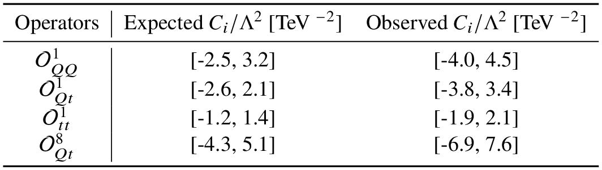

# Results for 4top cross-section

## Experimental Results:

 * [ATLAS (TOPQ-2021-08)](https://atlas.web.cern.ch/Atlas/GROUPS/PHYSICS/PAPERS/TOPQ-2021-08/): $`\sigma_{obs}  = 22.5^{+6.6}_{-5.5}`$ fb , $`\sigma_{SM}  = 12.0 \pm 2.4`$ fb
 * [CMS (TOP-22-013)](https://cms-results.web.cern.ch/cms-results/public-results/publications/TOP-22-013/): $`\sigma_{obs}  = 17.7^{+3.7}_{-3.5}(stat)^{+2.3}_{-1.9}(syst)`$ fb , $`\sigma_{SM}  = 13.4^{+1.0}_{-1.8}`$ fb


 * [ATLAS](https://atlas.web.cern.ch/Atlas/GROUPS/PHYSICS/PAPERS/TOPQ-2021-08/) limits on Wilson coefficients:

 <p float="center">
     
 </p>

 ## SM Results

  ```math
 \begin{split}
 \sigma_{QCD}^{LO} = & \\
 \sigma_{QCD}^{NLO} = & 11.9 \times 10^{-3} \text{ pb} 
\end{split}
```

 ## EFT Results

 Leading coefficient $`\left( \bar{t}_R \gamma^\mu t_R \right) \left( \bar{t}_R \gamma_\mu t_R \right)`$:

 ```math
 \begin{split}
 C_{uu}^{(3,3,3,3)} = & -\frac{y_{\text{DM}}^4}{128 \pi ^2} \frac{\left(1 + x(4-5x) +2 x(2+x)\log \left(x\right)\right)}{ M^2
   (1-x)^3}\\
 & -\frac{ g_s^2 y_{\text{DM}}^2}{1728 \pi ^2} \frac{\left(11 x^3-6 x^3 \log \left(x\right)-18 x^2+9 x-2\right) }{M^2 (x-1)^4} \\
 & -\frac{g_s^4}{5760 \pi ^2 M^2}
\end{split}
 ```
where $M$ is the colored scalar mass and $x = M_{\chi}^2/M^2$.

For large $y_{\text{DM}}$, the EFT contribution is dominated by term proportional to $y_{\text{DM}}^4$ and the $\mathcal{O}(y_{DM}^4)$ cross-sections are:


|$M$ | $\Delta m$ | $y_{\text{DM}}$ | $C_{uu}^{(3,3,3,3)}$  | $\sigma_{\text{SM}\times\text{EFT}}$ | $\sigma_{\text{EFT}\times\text{EFT}}$ |
-------|--------|---|-------|----|----|
|0.5 TeV | 10 GeV | 3  |  TeV $^{-2}$  |  fb  |  fb |
|0.5 TeV | 10 GeV | 5  |  TeV $^{-2}$  |  fb  |  fb |
|0.5 TeV | 10 GeV | 7  |  TeV $^{-2}$  |  fb  |  fb |
|1.1 TeV | 10 GeV | 5  |  TeV $^{-2}$  |  fb  |  fb |
|1.1 TeV | 10 GeV | 10 |  TeV $^{-2}$  |  fb  |  fb |
-------------------------

From the results above we see that for $`y_{\text{DM}} \gtrsim 5`$ the EFT expansion breaks down, since the EFT $`^{2}`$ term, which is of $`\mathcal{O}(1/\Lambda^4)`$ is larger than the interference term ($`\mathcal{O}(1/\Lambda^2)`$).

### Benchmarks

 * $`\left(M,M_{\chi}\right) = \left(500,400\right) `$ GeV:

 ```math
 \begin{split}
 \sigma_{\text{SM}\times\text{EFT}} & = y_{\text{DM}}^2\left(-1.6 \times 10^{-3}\text{ fb} \right) + y_{\text{DM}}^4 \left( -0.13 \times 10^{-3}\text{ fb} \right) +  \left( -7.5 \times 10^{-4}\text{ fb} \right)\\
 \sigma_{\text{SM}\times\text{BSM(1-loop)}} & = y_{\text{DM}}^2\left(-0.29 \times 10^{-3}\text{ fb} \right) + y_{\text{DM}}^4 \left( -0.18 \times 10^{-3}\text{ fb} \right) +  \left( -1.4 \text{ fb} \right)
 \end{split}
 ```


where the last term comes from pure BSM QCD ($`\mathcal{O}(g_s^{10})`$) contributions.

 * $`\left(M,M_{\chi}\right) = \left(500,490\right) `$ GeV:

 ```math
 \sigma_{\text{SM}\times\text{EFT}} = y_{\text{DM}}^2\left( -1.3 \times 10^{-3}\text{ fb} \right) +y_{\text{DM}}^4 \left( -1.07 \times 10^{-5}\text{ fb} \right) +  \left( -7.4 \times 10^{-4}\text{ fb} \right)
 ```

 * $`\left(M,M_{\chi}\right) = \left(1,0.9\right) `$ TeV:

 ```math
 \sigma_{\text{SM}\times\text{EFT}} = y_{\text{DM}}^2\left( -3.6 \times 10^{-4}\text{ fb} \right) +y_{\text{DM}}^4 \left( -1.5 \times 10^{-5}\text{ fb} \right) +  \left( -1.85 \times 10^{-4}\text{ fb} \right)
 ```

  * $`\left(M,M_{\chi}\right) = \left(10,9.9\right) `$ TeV:

 ```math
 \begin{split}
 \sigma_{\text{SM}\times\text{EFT}} & = y_{\text{DM}}^2\left( -3.3 \times 10^{-6}\text{ fb} \right) +y_{\text{DM}}^4 \left( -1.3 \times 10^{-8}\text{ fb} \right) +  \left( -1.83 \times 10^{-6}\text{ fb} \right)\\
 \sigma_{\text{SM}\times\text{BSM(1-loop)}} & = y_{\text{DM}}^2\left(-1.63 \times 10^{-6}\text{ fb} \right) + y_{\text{DM}}^4 \left( -1.21 \times 10^{-8}\text{ fb} \right) +  \left( -1.13 \text{ fb} \right)
 \end{split} 
 ```

## 1-Loop Results


 * $`\left(M,M_{\chi}\right) = \left(500,400\right) `$ GeV:

 ```math
 \sigma_{\text{SM}\times\text{EFT}} = y_{\text{DM}}^2\left( \times 10^{-3}\text{ fb} \right) + y_{\text{DM}}^4 \left(  \times 10^{-3}\text{ fb} \right) +  \left(  \times 10^{-3}\text{ fb} \right)
 ```