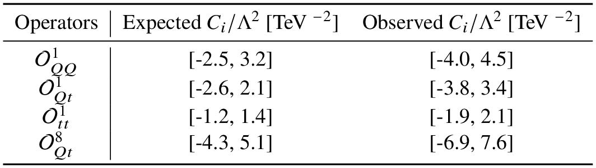

# Results for 4top cross-section

## Experimental Results:

 * [ATLAS (TOPQ-2021-08)](https://atlas.web.cern.ch/Atlas/GROUPS/PHYSICS/PAPERS/TOPQ-2021-08/): $`\sigma_{obs}  = 22.5^{+6.6}_{-5.5}`$ fb , $`\sigma_{SM}  = 12.0 \pm 2.4`$ fb
 * [CMS (TOP-22-013)](https://cms-results.web.cern.ch/cms-results/public-results/publications/TOP-22-013/): $`\sigma_{obs}  = 17.7^{+3.7}_{-3.5}(stat)^{+2.3}_{-1.9}(syst)`$ fb , $`\sigma_{SM}  = 13.4^{+1.0}_{-1.8}`$ fb


 * [ATLAS](https://atlas.web.cern.ch/Atlas/GROUPS/PHYSICS/PAPERS/TOPQ-2021-08/) limits on Wilson coefficients:

 <p float="center">
     
 </p>

 ## EFT Results

 Leading coefficient $`\left( \bar{t}_R \gamma^\mu t_R \right) \left( \bar{t}_R \gamma_\mu t_R \right)`$:

 ```math
 \begin{split}
 C_{uu}^{(3,3,3,3)} = & -\frac{y_{\text{DM}}^4}{128 \pi ^2} \frac{\left(x^2-2 x \log \left(x\right)-1\right)}{ M^2
   (x-1)^3}\\
 & -\frac{y_{\text{DM}}^2 g_s^2}{1728 \pi ^2} \frac{\left(11 x^3-6 x^3 \log \left(x\right)-18 x^2+9 x-2\right) }{M^2 (x-1)^4} \\
 & -\frac{g_s^4}{5760 \pi ^2 M^2}
\end{split}
 ```
where $M$ is the colored scalar mass and $x = M_{\chi}^2/M^2$.

For large $y_{\text{DM}}$, the EFT contribution is dominated by term proportional to $y_{\text{DM}}^4$.


|$M$ | $\Delta m$ | $y_{\text{DM}}$ | $C_{uu}^{(3,3,3,3)}$  | $\sigma_{\text{SM}\times\text{EFT}}$ | $\sigma_{\text{EFT}\times\text{EFT}}$ |
-------|--------|---|-------|----|----|
|0.5 TeV | 10 GeV | 3  | -0.08 TeV $^{-2}$  | -0.04 fb  | 0.03 fb |
|0.5 TeV | 10 GeV | 5  | -0.66 TeV $^{-2}$  | -0.33 fb  | 1.79 fb |
|0.5 TeV | 10 GeV | 7  | -2.56 TeV $^{-2}$  | -1.26 fb  | 26.5 fb |
|1.1 TeV | 10 GeV | 5  | -0.16 TeV $^{-2}$  | -0.07 fb  | 0.08 fb |
|1.1 TeV | 10 GeV | 10 | -2.65 TeV $^{-2}$  | -1.06 fb  | 19.1 fb |

-------------------------

From the results above we see that for $`y_{\text{DM}} \gtrsim 5`$ the EFT expansion breaks down, since the EFT $`^{2}`$ term, which is of $`\mathcal{O}(1/\Lambda^4)`$ is larger than the interference term ($`\mathcal{O}(1/\Lambda^2)`$).
