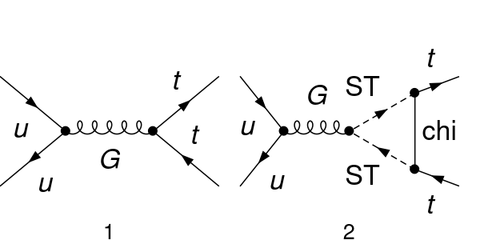
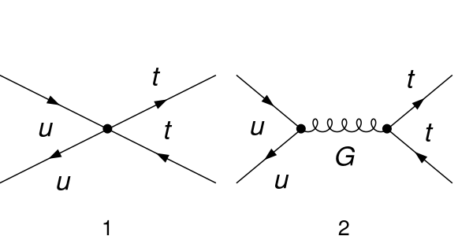
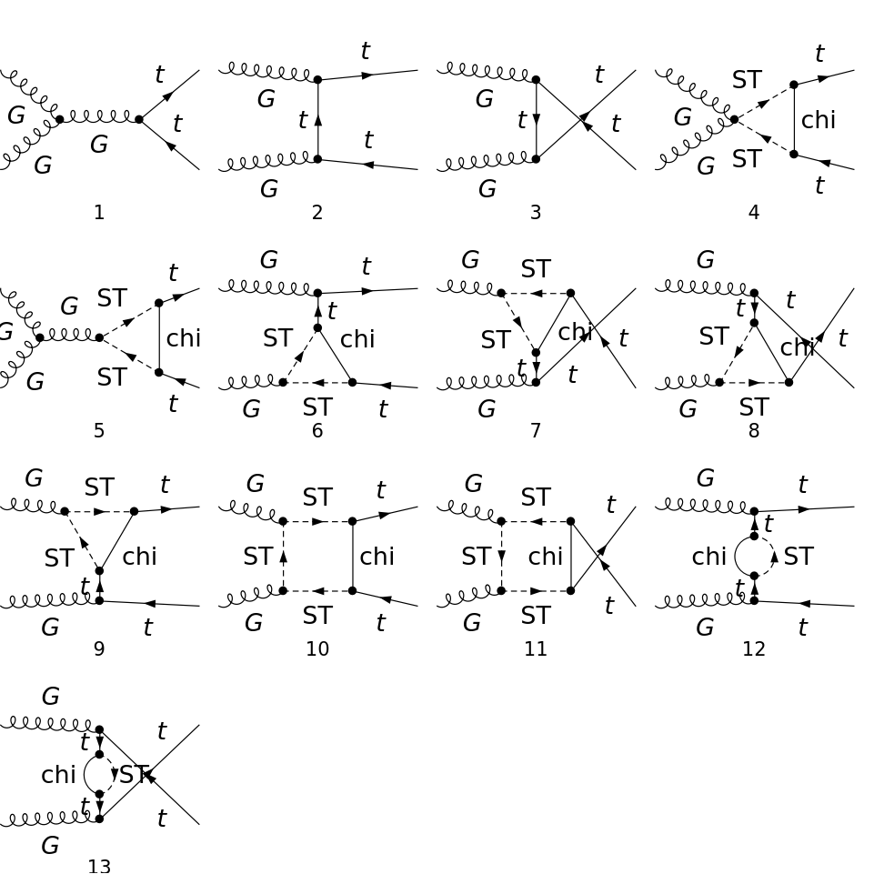
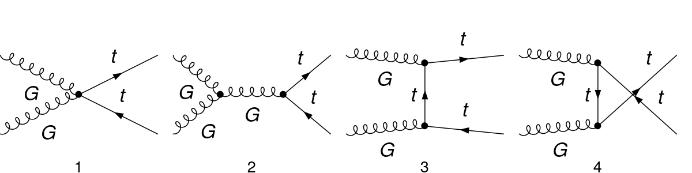

# Results for ttbar cross-section

 ## SM Results

  ```math
 \begin{split}
 \sigma_{QCD}^{LO} = &  \text{ pb} \\
 \sigma_{QCD}^{NLO} = &  \text{ pb} 
\end{split}
```

### 1) $`q + \bar{q} \rightarrow t + \bar{t}`$


| Model     | Diagrams  |
|-----------|-----------|
| 1 Loop    |  |
| EFT       |  |


#### Results

All the results below take $y_{DM} =1$ and $m_{t} = 172$ GeV and are proportional to $`y_{DM}^2`$.

  | Term        | $m_{T}$ (GeV) | $m_{\chi}$ (GeV) | 1 Loop (pb) | EFT (pb)    |
  | ----------- | ------------- | ---------------- | -------------------------- | ----------- | 
  |$\mathcal{M}^*_{\rm born} \mathcal{M}_1^{NP}$| 500   | 400  | $(1.23 \pm 0.7)\times10^{-2}$ | $( 0.919 \pm 0.002)\times10^{-2}$ | 
  |$\mathcal{M}^*_{\rm born} \mathcal{M}_1^{NP}$| 1000  | 900 | $(2.14 \pm 0.2)\times10^{-3}$   | $(2.325 \pm 0.004)\times10^{-3}$  |
  |$\mathcal{M}^*_{\rm born} \mathcal{M}_1^{NP}$| 10000  | 9900 | $(2.26 \pm 0.16)\times10^{-5}$   | $( 2.322 \pm 0.004)\times10^{-5}$   |


  
### 2) $`g + g \rightarrow t + \bar{t}`$
  
  
  | Model     | Diagrams  |
  |-----------|-----------|
  | 1 Loop    |  |
  | EFT       |  |
  
#### Results
  
All the results below take $y_{DM} =1$ and $m_{t} = 172$ GeV  and are proportional to $`y_{DM}^2`$.
  
   
  | Term        | $m_{T}$ (GeV) | $m_{\chi}$ (GeV) | 1 Loop (pb) | EFT (pb)    |
  | ----------- | ------------- | ---------------- | -------------------------- | ----------- | 
  |$\mathcal{M}^*_{\rm born} \mathcal{M}_1^{NP}$| 500   | 400  | $(-8.4 \pm 0.3)\times10^{-2}$ | $(-9.05 \pm 0.01)\times10^{-2}$ | 
  |$\mathcal{M}^*_{\rm born} \mathcal{M}_1^{NP}$| 1000  | 900 | $(-22.8 \pm 2)\times10^{-3}$   | $(-20.78 \pm 0.03)\times10^{-3}$  |
  |$\mathcal{M}^*_{\rm born} \mathcal{M}_1^{NP}$| 10000  | 9900 | $( -18.7\pm 0.5)\times10^{-5}$   | $(-19.35 \pm 0.03)\times10^{-5}$   |