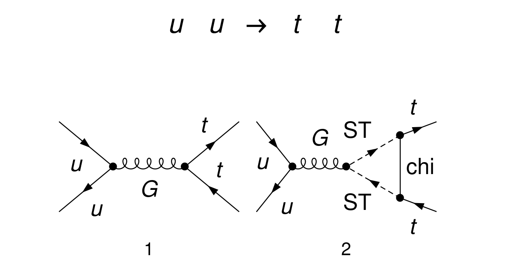
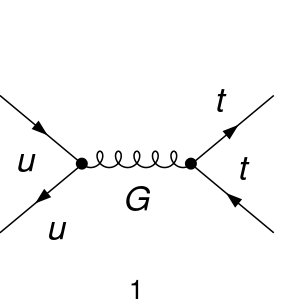
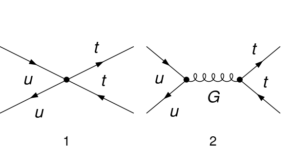
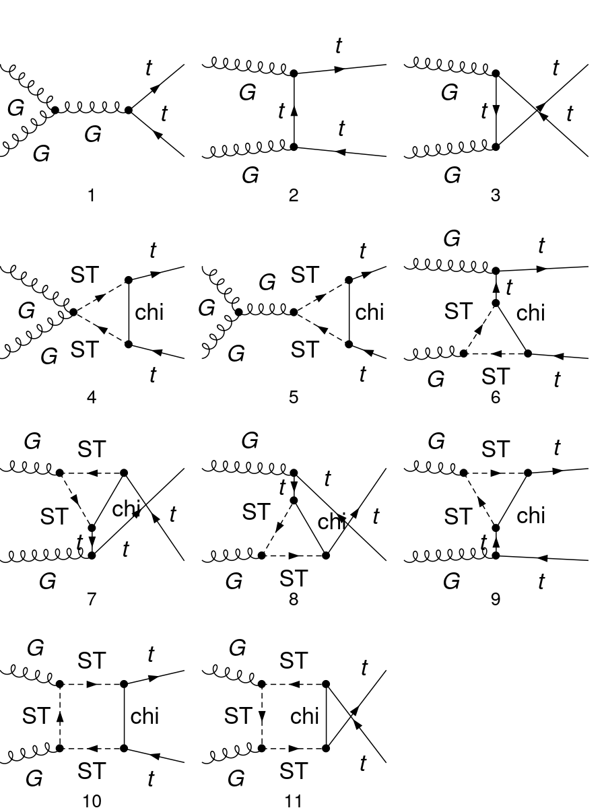
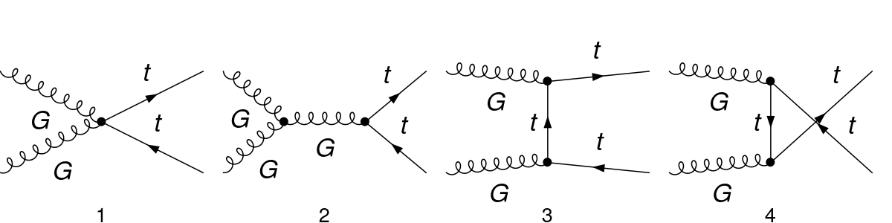
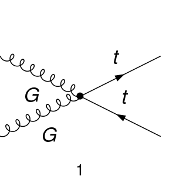

## Validation of Models

Below we present the validation of the distinct implementations of the SMS model:

 1. UV Simplified Model (SMS-stop): UV simplified model
 1. Top Couplings with Form Factors (Top-FormFactors):
    - OnShell: assumes on-shell tops (valid for $q + q \to \bar{t} + t$ production)
    - OneLoop: assumes off-shell tops for the $t-t-g$ vertex and the 1 loop calculation for the $t-t-g-g$ vertex with on-shell tops and gluons (valid for $g + g \to \bar{t} + t$ production)
  1. Top EFT physical (Top-EFTphysical): EFT matched model in the physical Basis.

### Top Pair Production: q + q > t + t

| Model     | Diagrams  |
|-----------|-----------|
| SMS-stop 1 loop |  |
| FormFactors |  |
| EFT |  |

#### Results

All the results below take $y_{DM} =1$ and $m_{t} = 172$ GeV.

  | Term        | $m_{T}$ (GeV) | $m_{\chi}$ (GeV) | Form Factors (1 loop) (pb) | EFT (pb)    | NLO-MG5  (pb) |
  | ----------- | ------------- | ---------------- | -------------------------- | ----------- | ------------- | 
  |$\mathcal{M}^*_{\rm born} \mathcal{M}_1^{NP}$| 400   | 100  | $(1.756 \pm 0.009)\times10^{-2}$ | $(1.101 \pm 0.006)\times10^{-2}$ | --- |
  |$\lvert \mathcal{M}_1^{NP} \rvert^2$         | 400   | 100  | $(3.785 \pm 0.013)\times10^{-5}$ | $(1.431 \pm 0.005)\times10^{-5}$ | $(3.800 \pm 0.006)\times10^{-5}$  |
  |  |  |  |  |   |   |
  |$\mathcal{M}^*_{\rm born} \mathcal{M}_1^{NP}$| 600   | 550  | $(7.957 \pm 0.02)\times10^{-3}$  | $(6.475 \pm 0.008)\times10^{-3}$ | --- |
  |$\lvert \mathcal{M}_1^{NP} \rvert^2$         | 600   | 550  | $(4.126 \pm 0.01)\times10^{-6}$  | $(1.878 \pm 0.003)\times10^{-6}$ | $(4.14 \pm 0.01)\times10^{-6}$  |
  |  |  |  |  |   |   |
  |$\mathcal{M}^*_{\rm born} \mathcal{M}_1^{NP}$| 5000  | 4000 | $(9.245 \pm 0.01)\times10^{-5}$   | $(9.212 \pm 0.01)\times10^{-5}$  | --- |
  |$\lvert \mathcal{M}_1^{NP} \rvert^2$         | 5000  | 4000 | $(4.31 \pm 0.005)\times10^{-10}$  | $(4.236 \pm 0.006)\times10^{-10}$| $(4.326 \pm 0.012)\times10^{-10}$  |
  |  |  |  |  |   |   |
  |$\mathcal{M}^*_{\rm born} \mathcal{M}_1^{NP}$| 5000  | 4900 | $(9.31 \pm 0.03)\times10^{-5}$   | $(9.346 \pm 0.03)\times10^{-5}$   | --- |
  |$\lvert \mathcal{M}_1^{NP} \rvert^2$         | 5000  | 4900 | $(3.782 \pm 0.008)\times10^{-10}$| $(3.725 \pm 0.01)\times10^{-10}$  | $(3.78 \pm 0.03)\times10^{-10}$  |
    

### Top Pair Production: g + g > t + t

| Model     | Diagrams  |
|-----------|-----------|
| SMS-stop 1 loop |  |
| FormFactors |  |
| EFT |  |

#### Results

  All the results below take $y_{DM} =1$ and $m_{t} = 172$ GeV.

  | Term        | $m_{T}$ (GeV) | $m_{\chi}$ (GeV) | Form Factors (1 loop) (pb) |   EFT (pb)  | NLO-MG5  (pb) |
  | ----------- | ------------- | ---------------- | -------------------------- | ----------- | ------------- |
  |$\mathcal{M}^*_{\rm born} \mathcal{M}_1^{NP}$ | 400   | 100  | $(-1.815 \pm 0.004 )\times10^{-1}$ | $(-2.188 \pm 0.004)\times10^{-1}$| --- |
  |$\lvert \mathcal{M}_1^{NP} \rvert^2$          | 400   | 100  | $(15.24 \pm 0.04)\times10^{-5}$    | $(6.005 \pm 0.01)\times10^{-5}$  | $(11.94 \pm 0.02)\times10^{-5}$ |
  |  |  |  |  |   |   |  |
  |$\mathcal{M}^*_{\rm born} \mathcal{M}_1^{NP}$ | 600   | 550  | $(-5.248 \pm 0.009)\times10^{-2}$  | $(-5.683 \pm 0.009)\times10^{-2}$| --- |
  |$\lvert \mathcal{M}_1^{NP} \rvert^2$          | 600   | 550  | $(6.388 \pm 0.02)\times10^{-6}$    | $(4.088 \pm 0.008)\times10^{-6}$ |  $( 5.23 \pm 0.07)\times10^{-6}$ |
  |  |  |  |  |   |   |  |
  |$\mathcal{M}^*_{\rm born} \mathcal{M}_1^{NP}$ | 5000  | 4000 | $(-8.996 \pm 0.015)\times10^{-4}$  | $(-9.005 \pm 0.02)\times10^{-4}$ | --- |
  |$\lvert \mathcal{M}_1^{NP} \rvert^2$          | 5000  | 4000 | $(10.28 \pm 0.02)\times10^{-10}$   | $(10.26 \pm 0.02)\times10^{-10}$ |  $(8.593 \pm 0.01)\times10^{-10}$ |
  |  |  |  |  |   |   |  |
  |$\mathcal{M}^*_{\rm born} \mathcal{M}_1^{NP}$ | 5000  | 4900 | $(-7.79 \pm 0.01)\times10^{-4}$    | $(-7.81 \pm 0.01)\times10^{-4}$  | --- |
  |$\lvert \mathcal{M}_1^{NP} \rvert^2$          | 5000  | 4900 | $( 7.67 \pm 0.02)\times10^{-10}$   | $(7.65 \pm 0.01)\times10^{-10}$  |  $( \pm )\times10^{-10}$ |
  |  |  |  |  |   |   |  |
  |$\mathcal{M}^*_{\rm born} \mathcal{M}_1^{NP}$ | 10000 | 9000 | $(-2.082 \pm 0.003 )\times10^{-4}$ | $(-2.083 \pm 0.02)\times10^{-4}$  | --- |
  |$\lvert \mathcal{M}_1^{NP} \rvert^2$          | 10000 | 9000 | $(5.442  \pm  0.009)\times10^{-11}$| $(5.441 \pm 0.009)\times10^{-11}$ |  $(4.533 \pm 0.03)\times10^{-11}$ |
<!-- 
#### Breakdown of the contributions to |M1(NP)|^2
  

All the results below take $m_{T} = 400$ GeV, $m_{\chi} = 400$ GeV,  $y_{DM} =1$ and $m_{t} = 172$ GeV and are in units of $10^{-5}$ pb. The numbers are for (NLO-MG5/OneLoop). "Self" refers to the diagrams with self-energy (with counter-terms), "Tri" refers to all diagrams with triangle loops (with counter-terms) and "Box" refers to all box diagrams.

  |        |  Self               | Tri                   | Box                   |
  | ------ | ----------          | ----------            | ----------            |   
  | Self   | $(0.0)$ / $(10.84)$ | $(29.59)$ / $(34.64)$ | $(0.0)$ / $(41.12)$   |
  | Tri    | --                  | $(66.05)$ / $(65.70)$ | $(32.62)$ / $(32.66)$ |
  | Box    | --                  | --                    | $(11.84)$ / $(11.86)$ | -->

